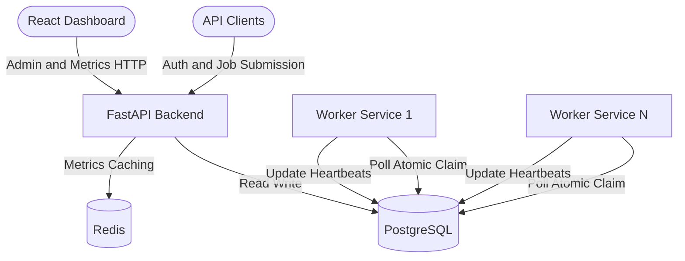
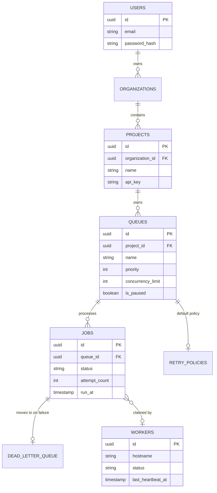

# Architecture & Database Diagrams

## System Architecture

```mermaid
graph TD
    Client([API Clients]) -->|Auth and Job Submission| API[FastAPI Backend]
    Dashboard([React Dashboard]) -->|Admin and Metrics HTTP| API
    API -->|Read Write| DB[(PostgreSQL)]
    API -->|Metrics Caching| Cache[(Redis)]
    
    Worker1[Worker Service 1] -->|Poll Atomic Claim| DB
    Worker2[Worker Service N] -->|Poll Atomic Claim| DB
    
    Worker1 -->|Update Heartbeats| DB
    Worker2 -->|Update Heartbeats| DB
```

## Entity Relationship (ER) Diagram

```mermaid
erDiagram
    USERS ||--o{ ORGANIZATIONS : "owns"
    ORGANIZATIONS ||--o{ PROJECTS : "contains"
    PROJECTS ||--o{ QUEUES : "owns"
    QUEUES ||--o{ JOBS : "processes"
    QUEUES ||--o| RETRY_POLICIES : "default policy"
    JOBS ||--o| DEAD_LETTER_QUEUE : "moves to on failure"
    JOBS }o--o| WORKERS : "claimed by"
    
    USERS {
        uuid id PK
        string email
        string password_hash
    }
    
    PROJECTS {
        uuid id PK
        uuid organization_id FK
        string name
        string api_key
    }
    
    QUEUES {
        uuid id PK
        uuid project_id FK
        string name
        int priority
        int concurrency_limit
        boolean is_paused
    }
    
    JOBS {
        uuid id PK
        uuid queue_id FK
        string status
        int attempt_count
        timestamp run_at
    }
    
    WORKERS {
        uuid id PK
        string hostname
        string status
        timestamp last_heartbeat_at
    }
```
